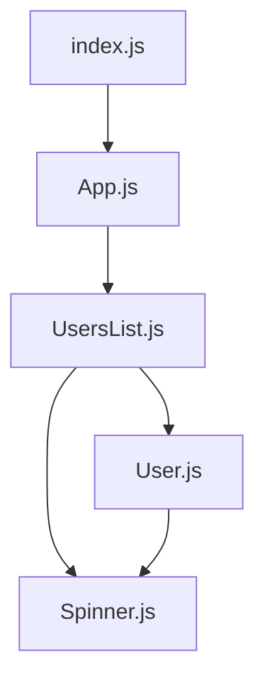

# Demo Project

Quick project to demo, changing state and fetching asyc.

There are few things to note:
- I'm using [styled-components](https://styled-components.com/) in the components to add CSS, this is one of the preferred ways (there are others, but this my fav)
- I created an [HTTP wrapper object (./src/helpers/http.js)](./src/helpers/http.js) around fetch to manage state of the AbortController()
- created a quick [CSS animation to have a loading animation](./src/components/Spinner.jsx)

Here's a component Hierarchy Diagram



## To get this working on local

It's a basic create react app so it should feel familiar. Go to a folder where you want to pull this down.

```
> git clone https://github.com/johndgarage/nemethcollab.git
```

Got into /nemethcollab/


To start
```
npm run start
```

Open VSCode from there to explore the project.